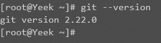



来源：[栈越](https://stackoverflow.com/questions/21820715/how-to-install-latest-version-of-git-on-centos-7-x-6-x)



```shell
yum install http://opensource.wandisco.com/centos/7/git/x86_64/wandisco-git-release-7-2.noarch.rpm
yum install git
```

一路 `y` 下去就行了

安装完成后输入一下指令就可以输出 `Git` 版本

```
git --version
```


