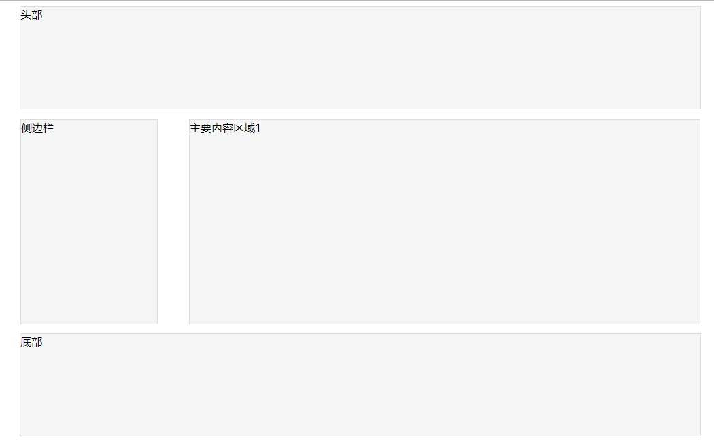
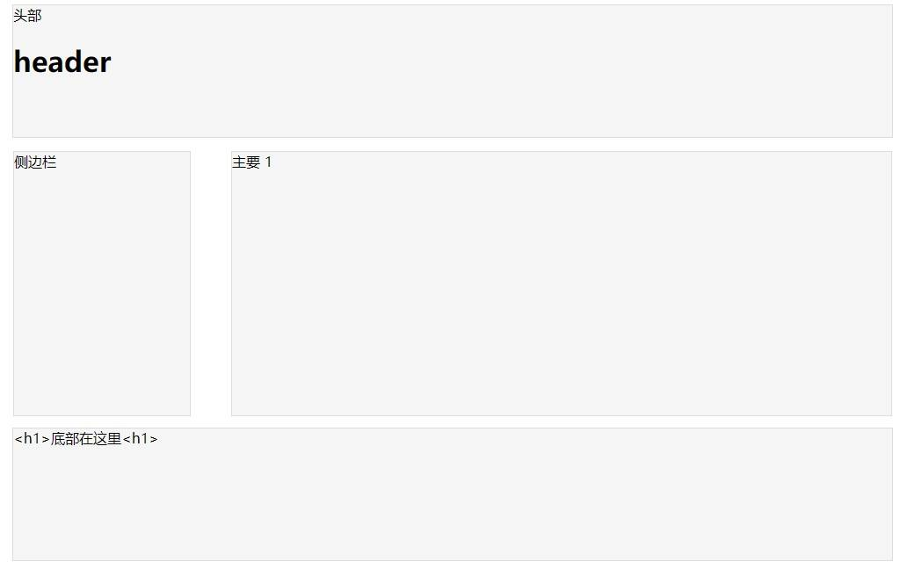
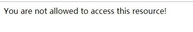
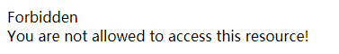
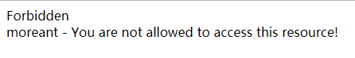
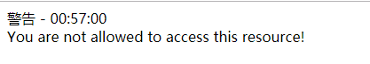

Blade 是 Laravel 提供的一个简单而又强大的模板引擎。主要参考了 Laravel 中文网的[文档](https://learnku.com/docs/laravel/5.7/blade/2265#displaying-data)

<!-- more -->


## 笔记归档

[Laravel 基础教程 笔记](https://mojuchen.github.io/tags/Laravel/)

## 简介

- Blade 并不限制你在视图中使用原生 PHP 代码。
- 所有 Blade 视图文件都将被编译成原生的 PHP 代码并缓存起来，除非它被修改，否则不会重新编译，这就意味着 Blade 基本上不会给你的应用增加任何负担。
- Blade 视图文件使用 `.blade.php` 作为文件扩展名，被存放在 `resources/views`目录。

## 模板继承

### 定义布局

这个是是教程中的基础模板，位置放在 *resources\views\*`layouts.blade.php`

```php+HTML
<!DOCTYPE html>
<html>

<head>
    <meta charset="UTF-8">
    <title>Laravel 基础教程 | Moreant</title>
    <style>
        header {
            width: 1000px;
            height: 150px;
            margin: 0 auto;
            background: #f5f5f5;
            border: 1px solid #ddd;
        }

        main {
            width: 1000px;
            height: 300px;
            margin: 0 auto;
            margin-top: 15px;
            clear: both;
        }

        main nav {
            float: left;
            width: 20%;
            height: inherit;
            background: #f5f5f5;
            border: 1px solid #ddd;
        }

        main .content {
            float: right;
            width: 75%;
            height: inherit;
            background: #f5f5f5;
            border: 1px solid #ddd;
        }

        footer {
            width: 1000px;
            height: 150px;
            margin: 0 auto;
            margin-top: 15px;
            background: #f5f5f5;
            border: 1px solid #ddd;
        }
    </style>
</head>

<body>
    <header>
        头部
    </header>
    <main>
        <nav>
            侧边栏
        </nav>
        <div class="content">
            主要内容区域
        </div>
    </main>
    <footer>
        底部
    </footer>
</body>

</html>
```

然后在 `body` 里定义布局，添加 `@section` 和 `@yield` 标记：

```php+HTML
<body>
    <header>
        @section('header')
        头部
        @show
    </header>
    <main>
        <nav>
            @section('nav')
            侧边栏
            @show
        </nav>
        <div class="content">
            @yield('content','主要内容区域')
        </div>
    </main>
    <footer>
        @section('footer')
        底部
        @show
    </footer>
</body>
```

`@section` 和 `@yield` 的区别是：

**@section** 标记的重点是**部分**

**@yield** 标记的重点是**位置**




### 继承布局

我们创建的是 student 的视图，因此视图的位置是 *resource\views\**student\***`section1.blade.php` ：

```php+HTML
@extends('layouts')

@section('title','Section1')

@section('header')

@parent

<h1>header</h1>

@endsection

@section('content')
主要
@endsection

@section('footer','<h1>底部在这里<h1>')
```

**@extends：**指定继承的布局

**@section：**指定替换父视图的部分，有两种写法

**@parent：**指定在这个 `@section` 中是增加内容，而不是覆盖

然后在 **控制器** 中指定渲染的视图

```php+HTML
public function section1()
    {
        // 也可以用 / 来表示层级 如 student/section1
        return view('student.section1');
    
    }
```

或者直接在路由中输出视图

```php+HTML
Route::view('ss','student.section1');
```




### Components & Slots

**components** 会主动引用视图，常用于设置复用的部分

**基础使用**

比如有一个会在整个应用中复用的警告，位置在 *respurces\views\*`alert.blade.php`：

```php+HTML
<div class="alert alert-danger">
    {{ $slot }}
</div>
```

然后在需要使用这个警告的地方标记：

```php+HTML
@component('alert')
You are not allowed to access this resource!
@endcomponent
```

**slot**

由于任何没有被 `@slot` 指令包裹住的内容将传递给组件中的 `$slot` 变量：

显示效果是这样的




`@slot` 是用于注入内容到已知的 slot 中，比如我们需要在上面的基础上添加标题：

```php+HTML
<div class="alert alert-danger">
    <div class="alert-title">{{ $title }}</div>

    {{ $slot }}
</div>
```

在需要使用的地方这样标记：

```php+HTML
@component('alert')
@slot('title')
Forbidden
@endslot

You are not allowed to access this resource!
@endcomponent
```

显示效果




**传递数据**

当然也可以传递数据，首先定义要显示的数据，在上面的基础上添加用户名：

```php+HTML
<div class="alert alert-danger">
    <div class="alert-title">{{ $title }}</div>
    {{ $name }} - {{ $slot }}
</div>
```

使用的时候在 component 的**第二个参数传入数组**即可：

```php+HTML
@component('alert',['name'=>'moreant'])
@slot('title')
Forbidden
@endslot

You are not allowed to access this resource!
@endcomponent
```

效果



**组件别名**

子目录中的 Blade 组件，使用别名访问更方便。现在假设有一个 Blade 组件存储在 `resources/views/components/alert.blade.php`，可以使用 `component` 方法给它起个 `alert` 的别名。通常，在 `AppServiceProvider` 的 `boot` 方法中完成这个操作：

```php+HTML
use Illuminate\Support\Facades\Blade;

Blade::component('components.alert', 'alert');
```

组件定义好别名后，使用指令渲染：

```php+HTML
@alert(['type' => 'danger'])
    You are not allowed to access this resource!
@endalert
```

也可以不传参数：

```php+HTML
@alert
    You are not allowed to access this resource!
@endalert
```

## 数据处理

### 传入数据

在上面的 **模板继承** 中已经涉及到一部分的数据传入了

[component的传入数据](https://mojuchen.github.io/post/46063.html#c&s-cdsj)

可以在 `view` 的第二个参数中传入数组

```php+HTML
Route::get('greeting', function () {
    return view('welcome', ['name' => 'Samantha']);
});
```

模板是php文件，自然也**能使用php函数**，例如在之前的警告中加入时间

```php+HTML
<div class="alert alert-danger">
    <div class="alert-title">{{ $title }} - {{ date('H:i:s') }} </div>
    {{ $slot }}
</div>
```





**示未转义数据**

默认情况下，Blade ` {{ }} `语句会自动调用 PHP 的 `htmlspecialchars` 函数防止 XSS 攻击。不想转义的话，可以使用以下语法：

```php+HTML
Hello, {!! $name !!}.
```

### 渲染 JSON

有时，为了初始化 JavaScript 变量，需要将传入视图的数组进行 JSON 化。例如：

```php+HTML
<script>
    var app = <?php echo json_encode($array); ?>;
</script>
```

然而，可以用 `@json` Blade 指令替代手动 `json_encode`：

```php+HTML
<script>
    var app = @json($array);
</script>
```

### 原样输出

由于许多 JavaScript 框架都使用花括号来表示给定的表达式应用在浏览器中显示，**你可以使用 @ 符号来告知 Blade 渲染引擎你需要保留这个表达式的原始形态**。例如：

```php+HTML
<h1>Laravel</h1>

Hello, @{{ name }}.
```

在这个例子中， `@` 符号最终将会被 Blade 引擎删除；达到不受 Blade 模版引擎影响的目的， 最终 ``表达式会保持不变使得 JavaScript 框架可以使用它。

**@verbatim 指令**

**在页面中如果你需要大部分内容展现 JavaScript 变量**，你可以使用 `@verbatim` 指令来包裹 HTML 内容，这样你就不必在每个 Blade 打印语句前加上 `@` 符号：

```php+HTML
@verbatim
    <div class="container">
        Hello, {{ name }}.
    </div>
@endverbatim
```

## 结构控制

### 循环控制

blade 提供了 `@if` 、 `@elseif` 、 `@else` 和 `@endif` 来构造 if 表达式、

```php+HTML
@if (count($records) === 1)
    我有一个记录！
@elseif (count($records) > 1)
    我有多个记录！
@else
    我没有任何记录！
@endif
```

为了方便， Blade 还提供了一个 `@unless` 指令：

```php+HTML
@unless (Auth::check())
    您还没有登录。
@endunless
```

除了上述的条件指令之外， `@isset` 和 `@empty` 指令也可以视为与 PHP 函数有相同的功能：

```php+HTML
@isset($records)
    // $records 被定义且不为空...
@endisset

@empty($records)
    // $records 是 "empty" 的...
@endempty
```

使用循环时，你也可以结束循环或跳过当前迭代：

```php+HTML
@foreach ($users as $user)
    @if ($user->type == 1)
        @continue
    @endif

    <li>{{ $user->name }}</li>

    @if ($user->number == 5)
        @break
    @endif
@endforeach
```

你也可使用单行指令来包含指令声明条件：

```php+HTML
@foreach ($users as $user)
    @continue($user->type == 1)

    <li>{{ $user->name }}</li>

    @break($user->number == 5)
@endforeach
```

**forelse**

```php+HTML
@forelse ($users as $user)
    <li>{{ $user->name }}</li>
@empty
    <p>No users</p>
@endforelse
```

### 循环变量

循环时，可以在循环内使用 `$loop` 变量。这个变量可以提供一些有用的信息，比如当前循环的索引，当前循环是否为首次迭代，抑或当前循环是否为末次迭代：

```php+HTML
@foreach ($users as $user)
    @if ($loop->first)
        This is the first iteration.
    @endif

    @if ($loop->last)
        This is the last iteration.
    @endif

    <p>This is user {{ $user->id }}</p>
@endforeach
```

在一个嵌套的循环中，可以通过使用 `$loop` 变量的 `parent` 属性来获取父循环中的 `$loop` 变量：

```php+HTML
@foreach ($users as $user)
    @foreach ($user->posts as $post)
        @if ($loop->parent->first)
            This is first iteration of the parent loop.
        @endif
    @endforeach
@endforeach
```

`$loop` 变量也包含了其它各种有用的属性：

| 属性               | 描述                               |
| :----------------- | :--------------------------------- |
| `$loop->index`     | 当前循环迭代的索引（从 0 开始）。  |
| `$loop->iteration` | 当前循环迭代 （从 1 开始）。       |
| `$loop->remaining` | 循环中剩余迭代数量。               |
| `$loop->count`     | 迭代中的数组元素总数。             |
| `$loop->first`     | 当前迭代是否为循环中的首次迭代。   |
| `$loop->last`      | 当前迭代是否为循环中的末次迭代。   |
| `$loop->depth`     | 当前循环的嵌套深度级别。           |
| `$loop->parent`    | 在嵌套循环中，父循环的 loop 变量。 |

## 引入子视图

Blade 的 `@include` 指令允许你从另一个视图中引入 Blade 视图。所有在父视图的可用变量在被引入的视图中都是可用的。

```php+HTML
<div>
    @include('shared.errors')

    <form>
        <!--表单内容 -->
    </form>
</div>
```

被引入的视图会继承父视图中的所有数据，同时也可以向引入的视图传递额外的数组数据：

```php+HTML
@include('view.name', ['some' => 'data'])
```

当然，如果尝试使用 `@include` 去引入一个不存在的视图，Laravel 会抛出一个错误。如果想引入一个不能确定存在与否的视图，你应当使用 @includeIf 指令：

```php
@includeIf('view.name', ['some' => 'data'])
```

如果想根据给定的布尔条件来 `@include` 一个视图，你可以使用 `@includeWhen` 指令：

```php
@includeWhen($boolean, 'view.name', ['some' => 'data'])
```

如果想引入给定视图数组中的第一个视图，你可以使用 `includeFirst` 指令：

```php
@includeFirst(['custom.admin', 'admin'], ['some' => 'data'])
```


更多关于 Blade 模板 的使用方法在 [这里](https://learnku.com/docs/laravel/5.7/blade/2265)

- [堆栈](https://learnku.com/docs/laravel/5.7/blade/2265#stacks)
- [服务注入](https://learnku.com/docs/laravel/5.7/blade/2265#service-injection)
- Blade 扩展
  - [自定义 If 语句](https://learnku.com/docs/laravel/5.7/blade/2265#custom-if-statements)