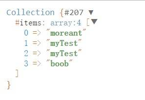
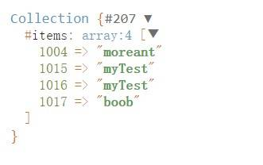

Laravel 有三种数据库操作方式，**DB Facades** , **查询构造器** , **Eloquent ORM**

<!-- more -->


## 笔记归档

[Laravel 基础教程 笔记](https://mojuchen.github.io/tags/Laravel/)

## 连接数据库

打开根目录的 `.env` 文件

9~14行就是数据库的配置信息了：

```php
DB_CONNECTION=mysql
DB_HOST=localhost
DB_PORT=3306
DB_DATABASE=laravel
DB_USERNAME=root
DB_PASSWORD=
```

演示中的创建表：

```PHP
create table if not exists student(

`id` INT AUTO_INCREMENT PRIMARY KEY,

`name` VARCHAR(255) NOT NULL DEFAULT '' COMMENT '姓名',

`age` TINYINT UNSIGNED not null DEFAULT 0 COMMENT '年龄',

`sex` TINYINT UNSIGNED not null DEFAULT 10 COMMENT '性别',

`created_at` DATETIME NULL DEFAULT NULL COMMENT '新增时间',

`updated_at` DATETIME NULL DEFAULT NULL COMMENT '修改时间'

)ENGINE=INNODB DEFAULT CHARSET=UTF8 AUTO_INCREMENT=1001 COMMENT='学生表';
```

## DB Facades

Laravel 给我们提供了 Facades 来更方便的使用静态接口。

所有的 Laravel Facades 都定义在 `Illuminate\Support\Facades` 命名空间下。

主要的方法有： `select` / `insert` / `update` / `delete`

使用 DB Facades 一定要 use：

```php
<?php

namespace App\Http\Controllers;

// 一般 use 都放这里
use Illuminate\Support\Facades\DB;

class StudentController extends Controller
{
    public function test()
    {
        // 操作
    }
}
```

**查询：**

```php
$arr = DB::select('select * from student');
```

**插入：**

```php
$bool =  DB::insert('insert into student (name, age) values (?, ?)', ['moreant', 18]);
```

**更新**：

```php
$int = DB::update('update student set age = ? where name = ?', ['19','moreant']);
```

**删除：**

```php
$int2 = DB::delete('delete from student where id > ?', [1005]);
```

[了解更多 Facades](https://learnku.com/docs/laravel/5.7/facades/2251)

## 查询构造器

Laravel 的**查询构造器**使用了 PDO 参数绑定来免受 SQL 注入攻击

### 插入

常用的插入方法有： `insert` / `insertGetId`

**简单插入：**

```php
$bool = DB::table('student')->insert(
    ['name'=>'test','age'=>20]

);
```

**获得自增 id：**

```php
$id = DB::table('student')->insertGetId(
    ['name'=>'boob','age'=>22]
);
```

**插入多条数据**：

```php
$bool = DB::table('student')->insertGetId(
    [
        ['name'=>'boob','age'=>15],
        ['name'=>'sanm','age'=>17],
        ['name'=>'job','age'=>14],
    ]
);
```

### 更新与自增

常用的更新方法有： `update` / `increment` / `decrement`

**基本使用：**

```php
$cow = DB::table('student')
    ->where('age', 19)
    ->update(['age' => 21]);
```

**自增 1：**

```php
$cow = DB::table('student')->increment('age');
```

**自增 3：**

```php
$cow = DB::table('student')->increment('age', 3);
```

**自减：**

```php
$cow = DB::table('student')->decrement('age', 2);
```

**有条件的自增：**

```php
$cow = DB::table('student')
    ->where('name', 'moreant')
    ->increment('age', 4);
```

**在自增同时修改其他数据**：

```php
$cow = DB::table('student')
    ->where('name', 'test')
    ->increment('age', 4, ['name' => 'myTest']);
```

### 删除

常用的删除方法有： `delete` / `truncate`

**删除指定条件：**

```php
$num = DB::table('student')
    ->where('id', '1004')
    ->delete();
```

**范围条件：**

```php
$num = DB::table('student')
    ->where('id', '>=', '1004')
    ->delete();
```

**清空表**

```php
DB::table('student')->truncate();
```

### 查询

常用的查询方法有： `get` / `first` / `where` / `pluck` / `select` / `chunk`

**get()**

获取所有表数据：

```php
$student = DB::table('student')->get();
```

**first()**

第一条数据：

```php
$student = DB::table('student')->first();
```

可以修改排序：

```php
$student = DB::table('student')
    ->orderBy('id','abs')
    ->first();
```

**where()**

条件查询：

```php
$student = DB::table('student')
    ->where('id', '>=', '1002')
    ->get();
```

多条件查询：

```php
$student = DB::table('student')
    ->whereRaw('id >= ? and age >= ?',[1004,19])
    ->get();
```

**pluck()**

返回指定字段：

```php
$student = DB::table('student')
    ->pluck('name');
```





自定义键值：

```php
$student = DB::table('student')
	->whereRaw('id >= ? and age >= ?',[1004,19])
	->pluck('name','id');
```





**select()**

指定返回的字段：

```php
$student = DB::table('student')
	->select('id','name')
	->get();
```

**chunk()**

分块结果，一次获取结果集的一小块，并将其传递给 `闭包` 函数进行处理：

```php
DB::table('student')->orderBy('id')->chunk(3, function ($students) {
    var_dump($students);
});
```

可以通过在 `闭包` 中返回 `false` 来终止继续获取分块结果：

```php
DB::table('student')->orderBy('id')->chunk(3, function ($users) {
    // Process the records...
    return false;
});
```

### 聚合函数

常用的聚合函数方法有： `count` / `max` / `min` / `avg` / `sum`

**count**

查询结果的总数：

```php
$num = DB::table('student')->count();
```

都可以结合其他查询语句：

```php
$num = DB::table('student')
    ->where('id','>=','1005')
    ->count();
```

**max**

查询结果的返回最大值

```php
$max = DB::table('student')->max('age');
```

**min**

查询结果的返回最小值：

```php
$min = DB::table('student')->min('age');
```

**avg**

平均值：

```php
$avg = DB::table('student')->avg('age');
```

**sum**

总和：

```php
$sum = DB::table('student')->sum('age');
```