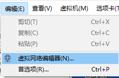
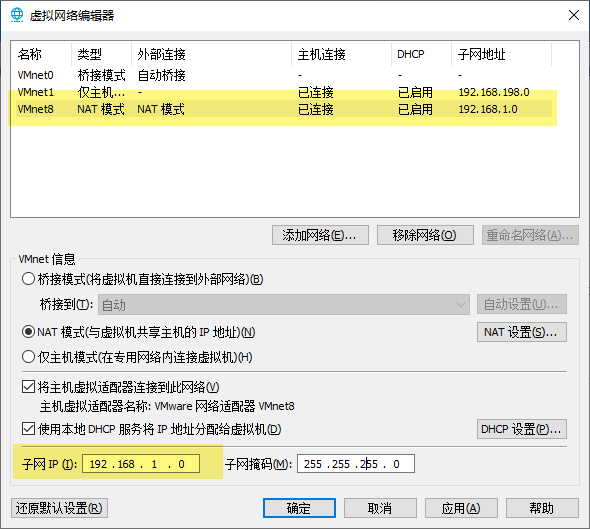
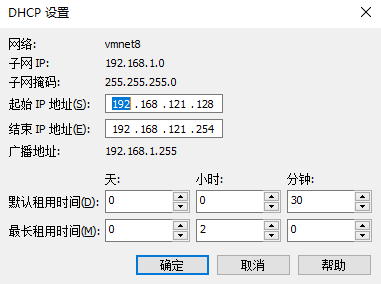
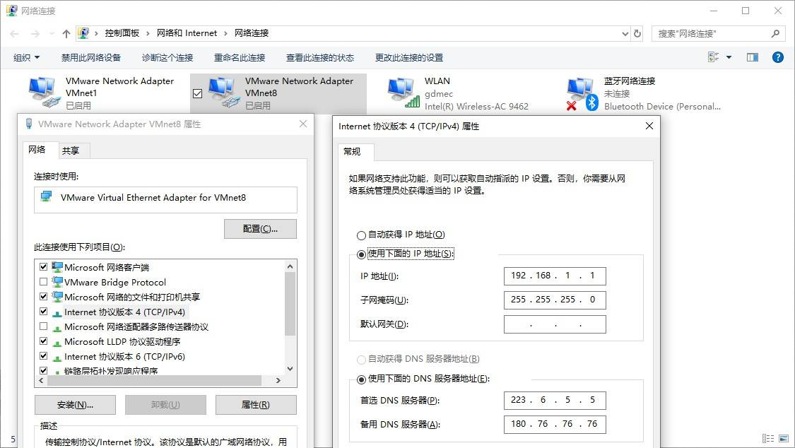

有时候为了另一种方便，需要将虚拟机指定为**手动固定**的 ip 地址。

<!-- more -->

## 环境

VMware版本：15.1.0

实体机系统：Windows 1903

虚拟机系统：Windows 7 

## VMware 设置

首先打开 **虚拟机网络编辑机**

然后选择 **NAT 模式** ，子网 IP 自己定义

进入 **DHCP 设置**，起始 IP 地址 和 结束 IP 地址根据上面的 子网 IP 进行配置

## Windows 设置

进入网络连接，如图设置

## 坑

- 如果虚拟机没有成功设置，请检查是否选择了 **NAT 模式**
- 如果虚拟机始终是**169.254.xxx.xxx**，请检查是否与**实体机**或者其他**虚拟机有ip地址冲突**

