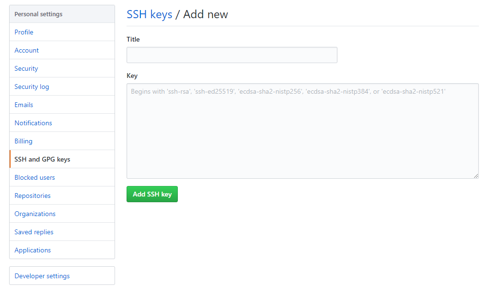
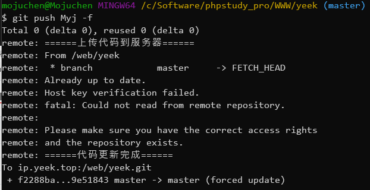

 自从使用 `Laravel` 框架之后，面对庞大的**文件夹结构**，再用 `FTP` 手动覆盖源文件更新网站的方法实在是太憨了。因此想到使用 `Git` 和 `hook` 就可以自动化更新和管理 Laravel项目 了，更别提 `Git` 本职的**版本管理**能减少意外翻车时的损失了。 

<!-- more -->



**无论如何**，都要先去了解一下 Git 的基本使用，否则你会大概率听不懂我在讲什么：

Git入门必看：[廖雪峰的Git教程](https://www.liaoxuefeng.com/wiki/896043488029600)

Git最佳实践：[Git 菜单](https://github.com/geeeeeeeeek/git-recipes)

Git之道文档：[Pro Git](http://iissnan.com/progit/)




## 前言

本文将在 `CentOS 7.6` 使用 `2.0` 版本以上的 `git` ，建立一个新的 `裸仓库` 利用 `Hook(钩子)` 来实现对 `Laravel` 为框架的项目实现**自动化**部署，管理。

### 目录结构

当前我服务器的的 **web目录** 是这样的


laradock——基于 `docker` 的环境部署轮子

yeek——站点目录

yeek.git——git仓库


### Q & A

**Q:** 为什么使用 `2.0` 版本以上的 `git` 。

**A:**因为貌似低版本的 `git` 不支持密钥登录，导致每次更新都账号密码，要这很不方便。

**Q:**为什么使用 `钩子+裸仓库` 而不直接在服务器上建一个仓库，与开发环境（本地）进行同步。

**A:** **Git默认拒绝向非裸仓库push** ([参考](https://blog.csdn.net/axiqia/article/details/80115133))，网上大把能解决这个问题的，但都特别折腾

所以正确的方式是，在服务器上**建立裸仓库**，然后在本地**push**到服务器，接着在站点目录 `clone` 裸仓库是。


## 添加秘钥

在**云服务器**的根目录下的 **home** 文件夹下创建一个git文件夹

```bash
mkdir /home/git
```

切换到创建好的git文件夹

```shell
cd /home/git
```

创建 .ssh文件夹，里面主要用来放公钥

```
mkdir .ssh
```

切换到.ssh文件夹并创建authorized_keys文件

```shell
cd .ssh
touch authorized_keys
```


然后在**本地计算机**里将 **.ssh** 文件夹里的 **id_rsa.pub** 中的内容复制到**云服务器**的 **authorized_keys** 文件中。

如果你的用户名目录下没有 **.ssh** 文件夹，请执行下面的指令，然后按三下回车。

```
ssh-keygen
```


## 创建仓库和设置 hook

在目录中创建一个**裸**仓库，然后给予权限

```
git init --bare /web/yeek.git
chown -R git:git yeek.git
```

如果没有 git 用户，就新建一个

```
sudo adduser git
```


克隆刚刚新建的仓库，给写入权限

```
git clone yeek.git
chown -R git yeek
```


进入**裸**仓库，添加钩子

```shell
cd /web/yeek.git/hooks
touch post-receive
vim post-recive
```

粘贴以下内容

```shell
#!/bin/sh
# 打印输出
echo '======上传代码到服务器======'
# 打开线上项目文件夹
cd /www/wwwroot/test/website
# 这个很重要，如果不取消的话将不能在cd的路径上进行git操作
unset GIT_DIR
git pull origin master
# 自动编译vue项目,如有需要请去掉前面的#号
# npm run build
# 自动更新composer（我暂时没试过）
# composer update
echo $(date) >> hook.log
echo '======代码更新完成======'
```

保存退出后添加执行权

```shell
chmod +x post-receive
```


## 安装项目

### 如果本地已有项目

创建仓库，添加文件，提交（如果之前设置可以直接忽略）

```
git init
git add .
git commit -m"first commit"
```


设置远程仓库，push到服务器

```
git remote origin git@服务器地址:仓库位置
git push origin master
```


###  如果本地没有项目

从服务器克隆到本地

```
git clone git@服务器地址:仓库位置
```

开发完成后，添加文件，提交，push到服务器

```
git add .
git commit -m"first commit"
git push
```


### 对于 laravel 项目

laravel 项目的clone等操作并不会同步所有文件，还需要进入到目录里进行初始化

```sh
composer install
cp .env.example .env
php artisan key:generate
sudo chmod -R 777 storage bootstrap/cache
```

如果是 `laradock`，123 是在 `workspace` 容器中执行的，4是在服务器上执行的


## 同步到 GitHub

我还希望更新服务器的时候能同时更新到 `GitHub` ，所以在上面的 `hook` 末尾加上下面的脚本，保存退出

```shell
echo '======推送到 GitHub 开始======'
git push github master
echo '======推送到 GitHub 完成======'
```

将 `home` 下的 git 文件夹里所有的文件所有者设置为 `git`

```
chown git:git -R /home/git/
```

切换到git用户，创建 ssh 秘钥，三连回车即可

```
su git
ssh-keygen
```

将 **home/git/.ssh/id_rsa.pub** 文件的内容复制到 `GitHub` 上的 [SSH and GPG keys](https://github.com/settings/keys) 中




进入项目目录 **/web/yeek** 添加GitHub的仓库地址，可以尝试一下手动推送

```shell
git remote add github 仓库地址
git push github
```


自此，已经完成了以 `git` 为基础的的自动化更新以及自动推送



