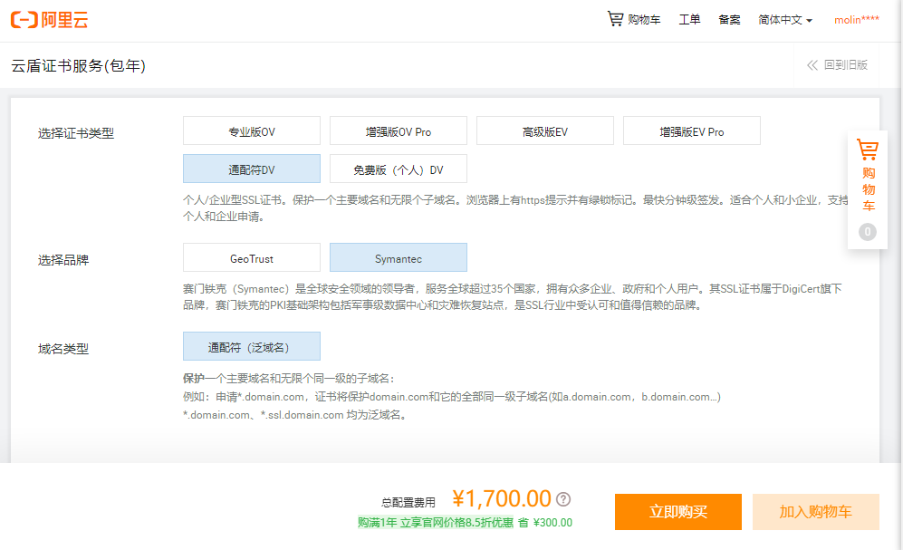
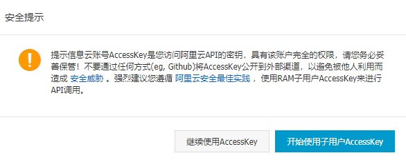
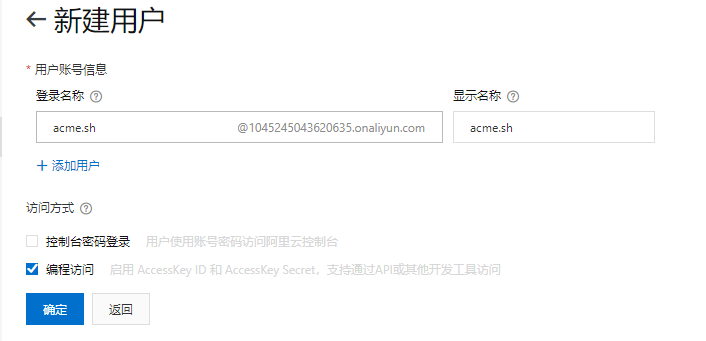
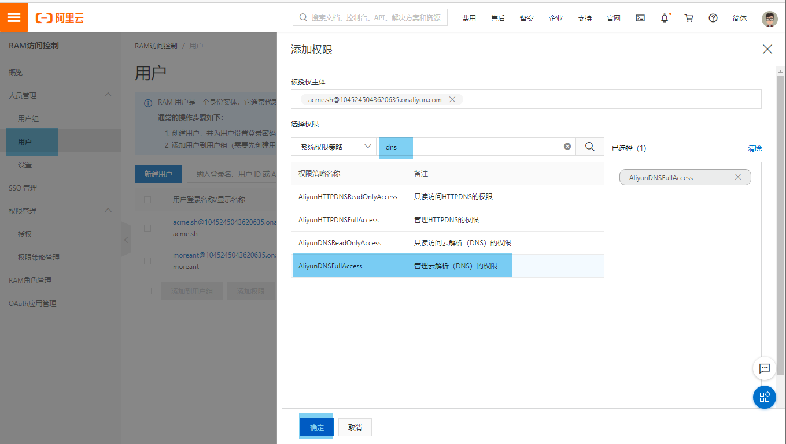
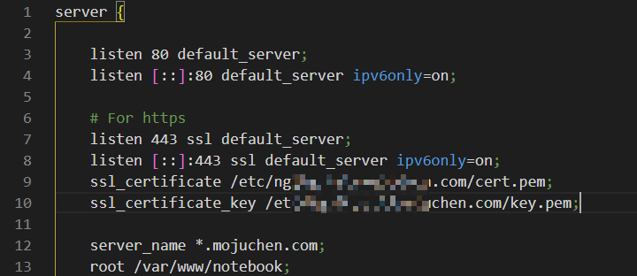
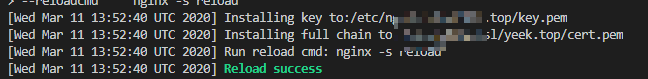
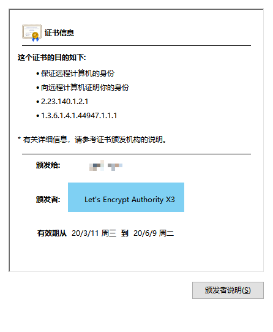

在服务商里，一张泛域名的 SSL 证书需要 1700￥。免费的 SSL 只支持单域名，并且一个主域名最多申请 **20** 次




而 **acme.sh** 利用 `acme` 协议，可以在 `letsencrypt`  **全自动且免费**的申请证书。


<!-- more -->


## 前言

申请泛域名证书需要使用 DNS API ，请确认你的 DNS 供应商在 `acme.sh` 的[支持范围内](https://github.com/acmesh-official/acme.sh/wiki/dnsapi)

本文以阿里云为例


如果你只需要单域名的证书，其实官方的 [中文文档](https://github.com/acmesh-official/acme.sh/wiki/%E8%AF%B4%E6%98%8E) 已经足够了，可以用更简单的 HTTP 方法。

> 本文主要参考自简书的 [acme.sh 配合 letsencrypt 配置泛域名](https://www.jianshu.com/p/dbe180979e77)


## 安装 acme.sh

在服务器中执行以下指令，会将 acme.sh 安装到 `~/` 目录中

```bash
curl  https://get.acme.sh | sh
```

<br>

创建 一个 bash 的 alias, 方便你的使用

```bash
alias acme.sh=~/.acme.sh/acme.sh
```

<br>

acme.sh 自动为你创建 cronjob, 每天 0:00 点自动检测所有的证书, 如果快过期了, 需要更新, 则会自动更新证书.

可以执行以下指令看到自动脚本

```
crontab -l
```


## 创建 Accesskey

图方便的话，可以使用全局 Accesskey。



<br>

为了安全，也是为了**方便管理**，最好创建一个专门用于 acme.sh 的子账号来生成 Accesskey

https://ram.console.aliyun.com/users/new



<br>

复制并**保存**创建好的 AccessKey 和 AccessKeySecret 后，给新用户添加 DNS API 权限




## 申请证书

在 ~/.acme.sh 中进行 Key 和 Secret 的设置

```bash
export Ali_Key="thisIsYouKey"
export Ali_Secret="thisIsYouSecret"
```

acme.sh 会自动保存到 `~/.acme.sh/account.conf` 中，方便以后再次使用。

<br>

发起申请，**记得修改成你的域名**： 

```bash
acme.sh --issue --dns dns_ali -d *.example.com 
```

之后会利用 DNS API 添加一条 `txt` 解析用于验证，验证过后会自动删除。

申请成功后，证书会生成在 `~/.acme.sh/*.example.com`。

别自己复制到 Nginx 目录里了，以后续订不会自动更新 Nginx 目录中的。


## 使用证书

这里仅介绍 `Nginx` 的使用， `Apache`以及其他的 `web` 服务可以在[官方wiki](https://github.com/acmesh-official/acme.sh/wiki/%E8%AF%B4%E6%98%8E)中找到相关设置。

首先开启 Nginx 的证书使用。

```
listen 443 ssl default_server;
listen [::]:443 ssl default_server ipv6only=on;
ssl_certificate /etc/nginx/ssl/example.com/cert.pem;
ssl_certificate_key /etc/nginx/ssl/example.com/key.pem;
```

<br>

输入以下指令创建对应的空白证书文件

```bash
mkdir /etc/nginx/ssl/
touch /etc/nginx/ssl/example.com cert.pem
touch /etc/nginx/ssl/example.com key.pem
```

<br>

接着输入以下指令写入到 Nginx 的证书目录中。**记得修改成你的目录**，如果没有就自己挑个位置。

 **`\` 代表转义换行符，所以下面是一条指令**

```bash
acme.sh --installcert -d *.example.com \
--key-file       /etc/nginx/ssl/example.com/key.pem  \
--fullchain-file /etc/nginx/ssl/example.com/cert.pem \
--reloadcmd    "nginx -s reload"
```

终端中显示 `Reload success`  就可以使用 `https`  访问了





最后，如果你想使用其他高级功能，建议去看官方的 wik，也顺便给个 start 吧。

https://github.com/Neilpang/acme.sh/wiki

