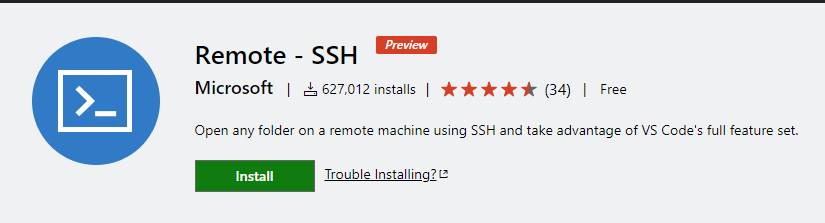
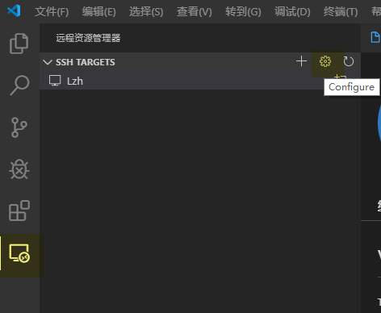
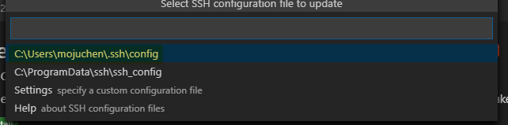
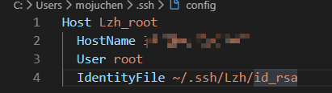
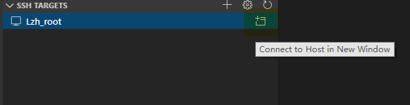
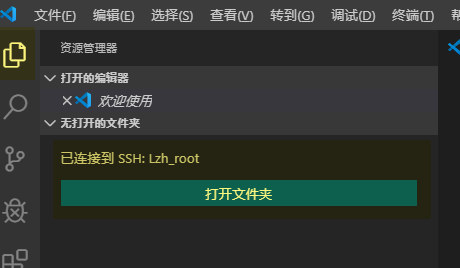
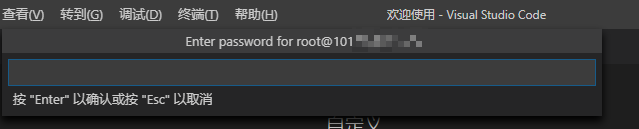
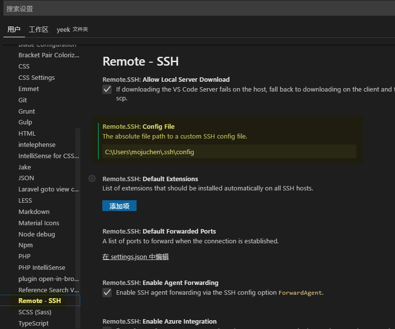
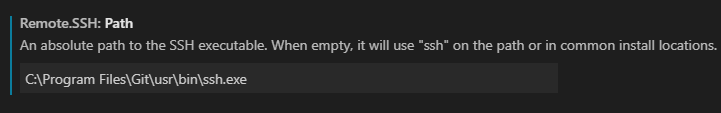

之前使用 `VS Code` 远程连接服务器之后，不仅**编辑文件**非常方便，看**目录结构**和**下载文件**都非常方便。最近换了电脑，发现没有记下相关的设置，所以现在记录一下。

<!-- more -->

## VS Code 远程连接

首先，`VS Code` 需要安装相应的插件

Remote - SSH [介绍页面](https://marketplace.visualstudio.com/items?itemName=ms-vscode-remote.remote-ssh)

在左侧栏会多出一个按钮，进入后点击设置按钮

这里选择用户名下的 `.ssh` 文件夹，因为这台电脑的其他用户不需要远程连接。

然后在 `config` 文件中填写远程连接的信息

| Host         | 远程连接的名称           |
| ------------ | ------------------------ |
| HostName     | 远程连接的ip地址         |
| User         | 远程连接的用户名         |
| IdentityFile | 远程连接的私钥路径(可选) |

之后点击这个进行远程连接了

连接成功后，就可以选择打开服务器上的文件夹了

## 使用秘钥登录

如果你没有使用秘钥登录，则每次连接服务器的时候都需要输入密码，比如重启和更换目录。



关于登录秘钥的设置可以参考下面这篇文章

> [CentOS 使用秘钥登录](/post/1528.html)



## 注意事项

### 缓存认证

第一次远程连接会询问你是否保存认证缓存，直接选第一个就行了

### 连接报错

我遇到了 Bad owner or permissions on C:\\Users\\Administrator/.ssh/config 报错的问题，解决办法就是将 `config` 文件的路径写在 `Remote-ssh` 插件的 `Config File` 属性里，然后**重启vscode**

之后我还是遇到了这种问题，实在被烦到不行，在设置中换成了 `Git` 的 `ssh`

### 使用私钥登录

如果不指定私钥的地址，就需要在每次远程连接时输入密码，这是一件非常麻烦的事情。如何在服务器里开启私钥登录，可以去菜鸟教程里了解



《[设置 SSH 通过密钥登录](https://www.runoob.com/w3cnote/set-ssh-login-key.html)》



