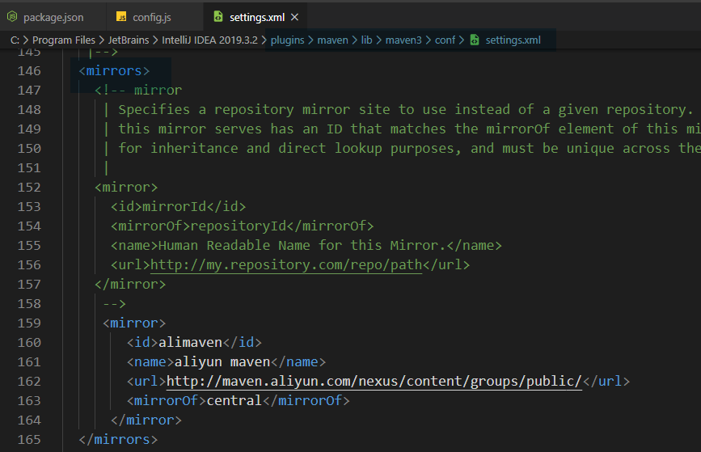

<center>混 IT 的谁没换过源呢？</center>

<!-- more -->

## composer 换阿里源

全局替换

```sh
composer config -g repo.packagist composer https://mirrors.aliyun.com/composer/
```

仅替换当前项目

```sh
composer config repo.packagist composer https://mirrors.aliyun.com/composer/
```


## npm 切换阿里云源


```sh
npm config set registry https://registry.npm.taobao.org/
```

查看是否切换成功

```sh
npm config get registry
```


## maven 换阿里源(IDEA)

进入 IDEA 的安装目录下的 `plugins/maven/lib/maven3/conf/settings.xml`

添加以下内容到 `<mirros>` 中

```xml
<mirror>  
      <id>alimaven</id>  
      <name>aliyun maven</name>  
      <url>http://maven.aliyun.com/nexus/content/groups/public/</url>  
      <mirrorOf>central</mirrorOf>          
</mirror>
```

