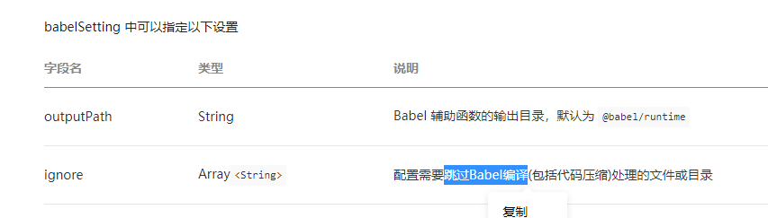
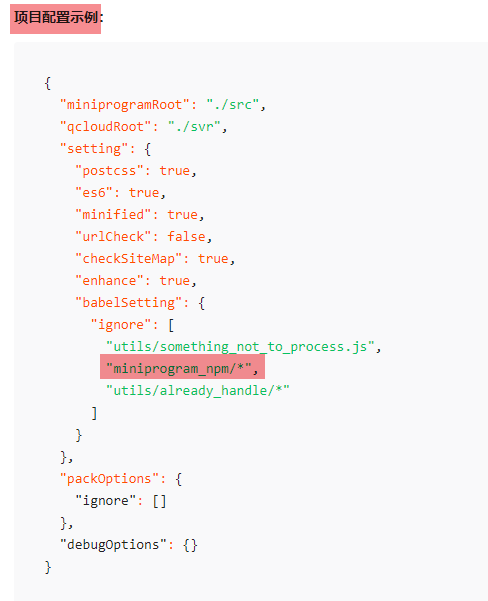
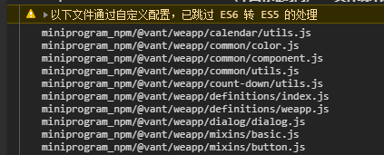

小程序支持使用 npm 安装其他依赖或者模块来增强小程序的功能。我就使用 Vant UI 来作为我小程序的 UI 库但是我在使用中遇到了各种模块编译的问题

<!-- more -->

## 疑难杂症

### 编译缓慢

自从安装了 Vant UI 之后，每次编译都能在下面看到底部在解析 js 文件。编译时间也从之前的 1 秒变成现在的 4-5秒。


## 解决办法

### 翻文档

首先，作为一个成熟的框架，一定是可以设置主动忽略某些文件夹/文件的。**翻文档**是找到这个设置最直接的办法。

果不其然，在开发者工具搜索**配置文件**就找到了——Babel编译。这个应该就是导致编译变慢的罪魁祸首了。




### 改配置

既然知道有这功能，就改改看看。

忽略某文件的 `Babel` 的编译，其实官方的示例就已经明示了，直接拿来用就行了



```json
"setting":{
    //其他略
    "babelSetting": {
		"ignore": [
			"miniprogram_npm/*"
		],
		"disablePlugins": [],
		"outputPath": ""
	}
}
```

设置修改完成后，清除缓存，重启开发者工具。在调试器里的控制台中看到这个忽略日志就说明配置成功了

